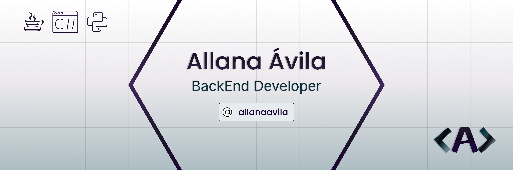

# Sobre mim
Profissional dedicada e em transição para a área de tecnologia da informação, com experiência em análise e modelagem de sistemas, incluindo criação de diagramas UML, fluxogramas e casos de uso.
- **Tomada de Decisão:** Habilidade para avaliar situações e tomar decisões estratégicas e informadas.
- **Trabalho em Equipe:** Colaboração eficaz com equipes multidisciplinares, promovendo a integração e o sucesso coletivo.
- **Aprendizado Rápido:** Capacidade de assimilar novas tecnologias e conceitos de forma eficiente e prática.
- **Desenvolvimento Contínuo:** Comprometida com o aprimoramento constante de competências técnicas e práticas.

Estou motivada a contribuir para projetos inovadores e desafiadores que conectem tecnologia e impacto positivo, utilizando minhas habilidades para gerar soluções de alto valor.

## Social

 

## Objetivos

- Consolidar minha carreira na área de tecnologia da informação, com foco no desenvolvimento de software.
- Contribuir para projetos que demandem análise criteriosa e soluções eficazes, aplicando métodos ágeis e boas práticas de desenvolvimento.
- Expandir competências técnicas e estratégicas, com ênfase no desenvolvimento backend e modelagem de sistemas.
- Colaborar em equipes multidisciplinares, promovendo inovação e entregas de alto valor.
- Participar de projetos que conectem tecnologia a impactos sociais significativos.

## Estatísticas

 

 

     
    

 

## Conhecimentos Técnicos

### BackEnd

    
    
    
    

### FrontEnd:

    
    
    

### Ferramentas:

    
    
    
    

### Banco de Dados

    
    
    

   

